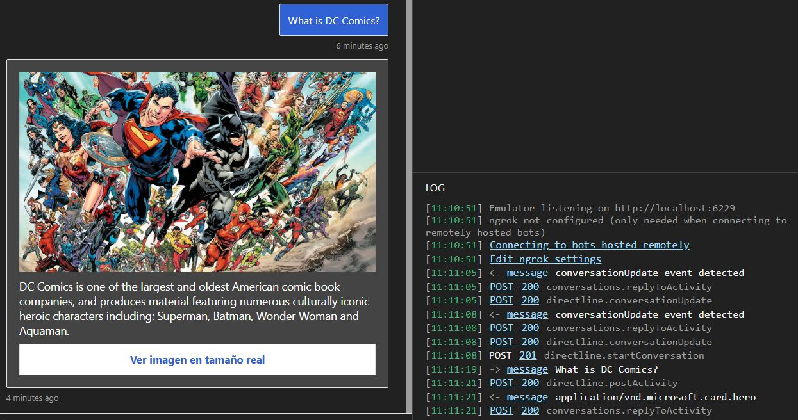
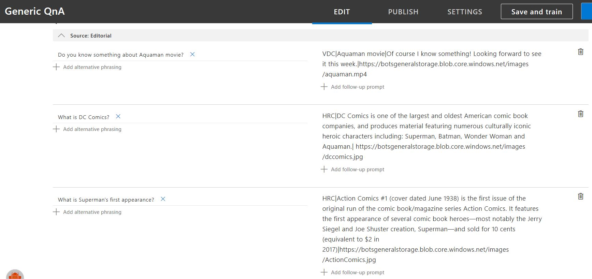
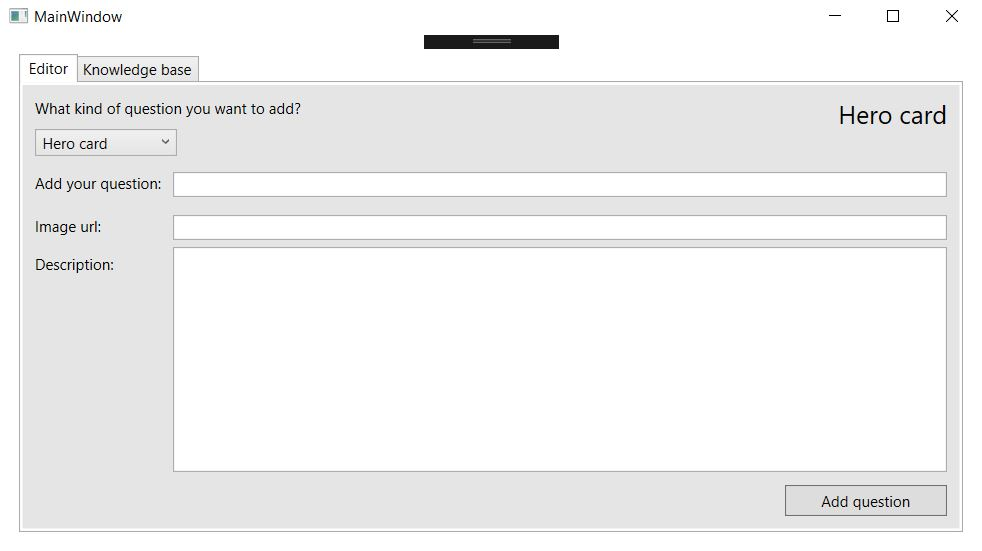

# QnA-Interactive

[Versión en español](http://github.com)

[Versao em portugues](http://gitub.com)

This repo is made to add functionality by using the best of both worlds. You can use this project and NuGet package in order to create the expected answer format and display it with the desired card presentation.

The idea is having this kind of response by using QnA Maker as engine.

In order to be allowed to use this package correctly and deploy a correct answer you'll need to follow the appropiate format in your QnA Knowledge Base. The structure is based to create an array of information separated by pipes ( | ), not a big deal right?

So, the answers will look like the following image.

Creating and editing this kind of format will be difficult and very boring for the person or team who will be feeding your Knowledge Base for that matter, you can use one small editor included in this repo.

## Getting started with the QnA Editor

If you clone/fork the repo and look for the QnA Editor you'll be able to make things easier for your editor's team. The interface is very straighforward.

## Getting started with the NuGet package

Repo made for creating interactive answers supported by a QnA Maker engine
